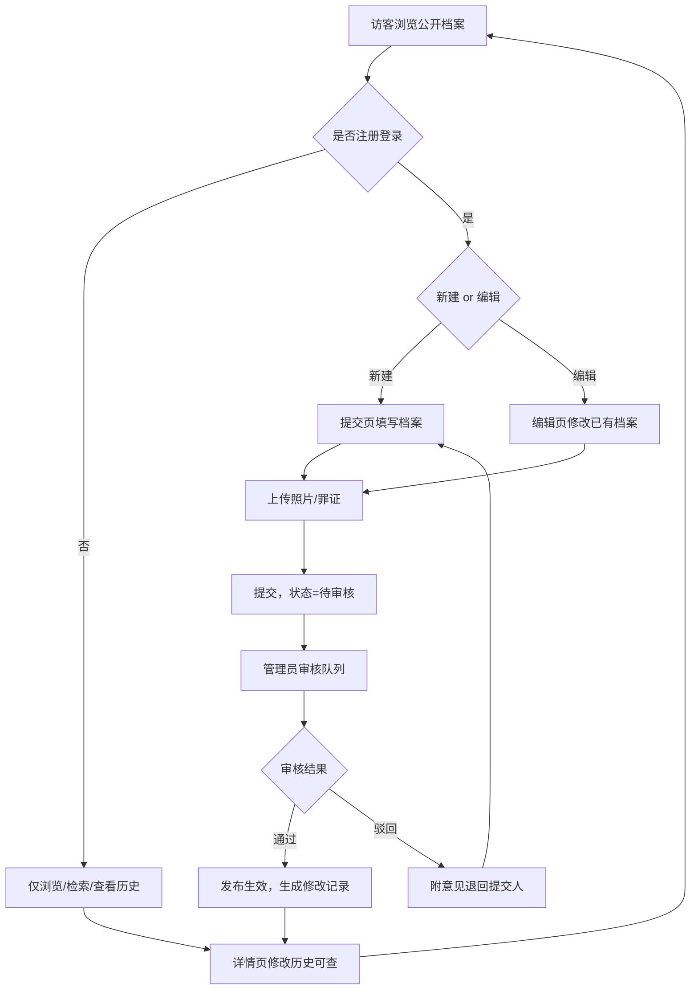

## 1. 产品概述

本项目是一个以"汉奸"为主题的史料型档案平台（Web 公众站 + 后台管理 + Flutter 移动端 App），面向历史研究者、教育工作者及公众用户，提供汉奸人物档案的集中查阅、检索、研读与协作编纂。
普通用户可注册登录后提交汉奸档案（含生卒、籍贯、姓名、配偶、子女、居住地、犯罪记录、照片、罪证等），提交数据经后台管理员审核通过后发布；所有汉奸档案支持查看历史修改记录（修改人、修改时间、修改内容、审核人、审核日期、审核结果），实现公开、可溯源、以史为鉴的教育价值。

## 2. 核心功能

### 2.1 用户角色

| 角色   | 注册方式    | 核心权限                                      |
| ---- | ------- | ----------------------------------------- |
| 访客   | 免注册     | 浏览已发布档案、使用检索、查看详情与修改历史                    |
| 注册用户 | 邮箱+密码注册 | 访客权限 + 提交新档案、编辑已有档案、上传照片/罪证、查看本人提交记录      |
| 管理员  | 后台授权提升  | 注册用户权限 + 审核提交/编辑（通过/驳回）、管理用户、维护时期/派系等分类数据 |

### 2.2 功能模块

1. **首页（公开）**：汉奸定义标准（悬浮）、统计看板、三维检索（名称/时间/事件）、人物卡片墙（按历史时期分类）、事件时间线
2. **汉奸详情页（公开）**：人物基本信息、生平时间线、犯罪记录、配偶、子女、居住地、照片、罪证、史料来源、相关人物、**修改历史**
3. **关于页（公开）**：编纂说明、定义标准全文、统计方法论、免责声明
4. **认证模块**：注册页、登录页、个人中心（本人提交记录与状态）
5. **提交/编辑模块（登录后）**：表单提交新汉奸档案、编辑已有档案，支持上传照片与罪证文件，提交后进入待审状态
6. **修改历史模块（公开）**：每条档案的修改记录列表，含修改人、修改时间、修改内容摘要、审核人、审核日期、审核结果
7. **后台审核模块（管理员）**：待审队列、审核详情（对比新旧内容）、通过/驳回（附审核意见）
8. **移动端 App（Flutter）**：与公众站一致的浏览/检索/档案详情/修改历史查看与登录能力，复用同一 Web API

### 2.3 页面详情

| 页面名称 | 模块名称   | 功能描述                                                |
| ---- | ------ | --------------------------------------------------- |
| 首页   | 顶部导航   | 站点标识、主导航（首页/关于）、登录/注册或用户菜单入口                        |
| 首页   | 英雄区    | 站点立意引言、水墨动态背景、"汉奸定义标准"按钮触发**右侧悬浮**弹框          |
| 首页   | 统计看板   | 汉奸总数、被判刑总数、子女信息数、后代现状数四项滚动计数                        |
| 首页   | 综合检索   | 按名称/时间区间/事件关键词三维检索，支持组合查询                           |
| 首页   | 人物卡片墙  | 按"历史时期（宋末/明末/清末/民国/其他）"分类筛选，选中时期显示年代范围与释义           |
| 首页   | 事件时间线  | 纵向时间轴展示重大汉奸事件节点                                     |
| 详情页  | 人物头部   | 时期、派系、姓名、字/号、生卒年、籍贯、身份标签、人物照片                       |
| 详情页  | 生平时间线  | 竖向时间轴展示关键人生节点与汉奸行为                                  |
| 详情页  | 犯罪记录   | 事件卡列表：时间、事件名、经过、危害、史料出处                             |
| 详情页  | 配偶信息   | 配偶列表：姓名、备注                                          |
| 详情页  | 子女信息   | 子女名单表格：姓名、性别、去向、备注                                  |
| 详情页  | 居住地    | 居住地变迁列表：地点、时期、备注                                    |
| 详情页  | 照片     | 人物照片画廊（缩略图+大图查看）                                    |
| 详情页  | 罪证     | 罪证材料列表（文档/图片，附说明与来源）                                |
| 详情页  | 史料来源   | 引用文献列表与可信度标注                                        |
| 详情页  | 相关人物   | 同案/同期关联人物链接                                         |
| 详情页  | 修改历史   | 该档案修改记录时间线：修改人/修改时间/修改内容摘要/审核人/审核日期/审核结果            |
| 详情页  | 编辑入口   | 登录用户可见"编辑此档案"按钮，跳转编辑页                               |
| 关于页  | 编纂说明   | 立场、范围、收录原则                                          |
| 关于页  | 定义标准全文 | 汉奸认定的五项标准详解                                         |
| 关于页  | 统计方法论  | 数据来源、统计口径、更新机制                                      |
| 关于页  | 免责声明   | 史料引用规范与责任声明                                         |
| 注册页  | 注册表单   | 用户名、邮箱、密码、确认密码，校验与提交                                |
| 登录页  | 登录表单   | 邮箱/用户名 + 密码，登录后写入 Token 跳回来源页                       |
| 个人中心 | 提交记录   | 当前用户提交的档案列表与审核状态（待审/通过/驳回）                          |
| 提交页  | 档案表单   | 录入姓名/字/号/生卒/籍贯/时期/派系/配偶/子女/居住地/犯罪记录/照片/罪证/史料来源，提交待审 |
| 编辑页  | 档案表单   | 基于已有档案预填，修改后提交为待审修订                                 |
| 后台审核 | 待审队列   | 待审提交/修订列表，按时间倒序                                     |
| 后台审核 | 审核详情   | 新旧内容对比、修改人、修改内容摘要，通过/驳回+审核意见                        |
| 后台审核 | 审核结果回执 | 通过则发布生效，驳回则附意见退回提交人 |

**移动端 App 页面（Flutter）：**

| 页面名称 | 功能描述 |
| -------- | --------------------------------------------------- |
| 首页     | 统计看板、三维检索、人物卡片墙（按时期筛选）、事件时间线 |
| 档案详情 | 人物头部、生平时间线、犯罪记录、配偶/子女/居住地、照片/罪证、史料来源、修改历史 |
| 登录/注册 | 复用 Web API 认证，Token 本地安全存储                |
| 个人中心 | 本人提交记录与审核状态（待审/通过/驳回）              |

## 3. 核心流程

**公开浏览流程：**
访客进入首页 → 浏览定义标准与统计 → 检索或卡片墙筛选 → 进入详情页 → 查看生平/犯罪记录/配偶/子女/居住地/照片/罪证/史料 → 查看该档案修改历史 → （可选）注册登录参与编纂。

**协作编纂与审核流程：**
注册用户登录 → 进入提交页填写档案并上传照片/罪证 → 提交后状态为"待审核" → 管理员在后台审核队列查看 → 对比内容、通过或驳回（附意见） → 通过则档案发布、生成修改记录；驳回则退回提交人修改 → 任何用户可在详情页"修改历史"查看全部记录（修改人/修改时间/修改内容/审核人/审核日期/审核结果）。

**编辑已有档案流程：**
登录用户在详情页点"编辑此档案" → 修改字段 → 提交为待审修订（原已发布版本保持可见） → 管理员审核 → 通过后覆盖发布并记录历史；驳回则保留原版本。



## 4. 用户界面设计

### 4.1 设计风格

- **美学方向**：史册档案风（Editorial Archive × 水墨历史感），庄重、肃穆、文献质感
- **主色**：墨黑 `#0E0B08`（背景）、宣纸米白 `#F2EAD8`（内容底）、朱砂红 `#9B2B2B`（强调/警示）、古铜金 `#8C6B3A`（次强调/标签）
- **次色**：竹青 `#3E544A`、灰墨 `#2B2620`、做旧纸边 `#D9CBA8`
- **字体**：标题用"霞鹜文楷/思源宋体"类衬线，正文用"Noto Serif SC"，数字与英文用"EB Garamond"
- **按钮风格**：扁平做旧，带朱砂印章式边角，悬停浮现纸纹
- **布局风格**：左右分栏史料册式布局，卡片墙瀑布流，时间线纵向铺陈
- **状态色**：待审=古铜金、通过=竹青、驳回=朱砂红
- **图标/装饰**：印章纹样、卷轴边框、水墨晕染、做旧纸纹
- **动效**：水墨晕染入场、数字滚动计数、时间线渐入、卷轴展开式过渡

### 4.2 页面设计概览

| 页面名称   | 模块名称  | UI 元素                                       |
| ------ | ----- | ------------------------------------------- |
| 首页     | 顶部导航  | 墨色半透明底、朱砂印章Logo、宋体导航、登录/用户菜单                |
| 首页     | 英雄区   | 水墨动态背景、大号宋体引言、"汉奸定义标准"按钮触发**右侧悬浮**弹框展示五项标准 |
| 首页     | 统计看板  | 四列卡片，古铜金描边，数字滚动动画                           |
| 首页     | 综合检索  | 三栏检索表单，朱砂按钮，即时结果预览                          |
| 首页     | 人物卡片墙 | 瀑布流卡片，时期/姓名/生卒/派系标签，按历史时期分类筛选               |
| 首页     | 事件时间线 | 纵向时间轴，朱砂节点，事件卡左右交替                          |
| 详情页    | 人物头部  | 左侧照片+朱砂印章，右侧时期/派系/姓名/字 号/生卒/籍贯/标签云          |
| 详情页    | 修改历史  | 时间线，每条含修改人/时间/内容摘要/审核人/日期/结果状态徽章            |
| 详情页    | 犯罪记录  | 事件卡列表，卡内分区：时间/事件名/经过/危害/出处                  |
| 详情页    | 配偶    | 做旧列表，姓名+备注                                  |
| 详情页    | 子女信息  | 做旧表格，朱砂表头                                   |
| 详情页    | 居住地   | 变迁时间线，地点+时期+备注                              |
| 详情页    | 照片    | 画廊缩略图网格，点击大图灯箱                              |
| 详情页    | 罪证    | 材料列表，类型图标+说明+来源，可预览                         |
| 注册/登录页 | 表单    | 居中卷轴卡片，朱砂按钮，墨色背景                            |
| 个人中心   | 提交记录  | 表格列表，状态徽章（待审/通过/驳回），可跳转编辑                   |
| 提交/编辑页 | 档案表单  | 分段表单（基本信息/家族/居住地/犯罪记录/照片/罪证/史料），时期下拉，文件拖拽上传 |
| 后台审核   | 待审队列  | 表格列表，状态过滤，点击进入审核详情                          |
| 后台审核   | 审核详情  | 新旧对比双栏，审核意见输入，通过/驳回按钮                       |

### 4.3 响应式

- 桌面优先（≥1280px 完整双栏史册布局）
- 平板（768-1279px）单栏折叠，卡片墙两列
- 移动端（<768px）单栏堆叠，时间线单侧，表单竖排，触控优化按钮≥44px

### 4.4 3D 场景指引

本项目不涉及 3D 场景。

## 5. 仓库结构与工程组织

### 5.1 仓库结构（四个完全独立的子项目）

根目录仅包含 `admin`、`web`、`mobileapp`、`webapi` 四个子项目，彼此完全独立：各自维护依赖、脚本与类型定义，无共享包，仅通过 REST API（JWT）通信。

```
HanJianNet/
├── web/                     # 公众网站（React 18 + Vite + Tailwind + TS）
│   └── src/
│       ├── pages/           # 首页/详情/关于/登录注册/提交/编辑/个人中心/修改历史
│       ├── components/      # 公共组件（含 ProtectedRoute）
│       ├── stores/          # zustand（auth store）
│       └── lib/             # api 客户端等前端基础设施
├── admin/                   # 后台管理（React 18 + Vite + TS，独立应用）
│   └── src/
│       ├── pages/           # 管理员登录/待审队列/审核详情
│       ├── components/      # AdminLayout 等
│       ├── stores/
│       └── lib/
├── mobileapp/               # 移动端 App（Flutter）
│   └── lib/
│       ├── screens/         # 首页/档案详情/登录注册/个人中心
│       ├── models/          # DTO 模型
│       ├── services/        # API 客户端
│       └── widgets/
├── webapi/                  # Express Web API（TypeScript ESM，唯一后端）
│   ├── src/
│   │   ├── routes/
│   │   ├── middleware/      # 鉴权/上传/错误捕获
│   │   ├── controllers/
│   │   ├── services/        # AuthSvc/TraitorSvc/RevisionSvc/UploadSvc
│   │   └── db.ts            # PrismaClient 单例
│   ├── prisma/              # schema.prisma / seed.ts
│   ├── uploads/             # 用户上传文件存储（照片/罪证）
│   ├── .env                 # 环境变量（已 gitignore，不提交）
│   └── .env.example         # 环境变量清单模板（可提交）
└── *.md                     # 项目文档（PRD / 架构 / README）
```

**职责边界：**
- `web/` 面向访客与注册用户，承担检索、浏览、提交、编辑流程；
- `admin/` 独立后台应用，仅供管理员使用，承担审核队列与审核操作；
- `mobileapp/` 面向移动端用户，提供浏览/检索/详情/登录能力，复用同一 Web API；
- `webapi/` 为唯一后端，同时服务三个客户端，持有数据库（SQLite/Prisma）与上传文件；
- 各项目类型与校验各自维护，前后端以 REST DTO 约定对齐。

### 5.2 启动方式（各项目独立启动）

```bash
# 终端 1：API（先跑，三个客户端都要请求它）
cd webapi && npm install && npm run dev        # http://localhost:3000

# 终端 2：公众网站
cd web && npm install && npm run dev           # http://localhost:5173 （Vite 已代理 /api 与 /uploads → 3000）

# 终端 3：后台管理系统
cd admin && npm install && npm run dev         # http://localhost:5174 （Vite 已代理 /api 与 /uploads → 3000）

# 终端 4：移动端 App（需 Flutter SDK）
cd mobileapp && flutter run                    # API 地址在配置中指向 http://<主机>:3000
```

> 首次启动 webapi 前：`npm run db:generate && npm run db:push && npm run db:seed`。

**端口约定：**

| 应用 | 端口 | 说明 |
|------|------|------|
| webapi | 3000 | REST + JWT + 静态托管 /uploads |
| web | 5173 | Vite dev server，代理 /api、/uploads → 3000 |
| admin | 5174 | Vite dev server，代理 /api、/uploads → 3000 |
| mobileapp | — | 原生 App，API 地址可配置 |

### 5.3 常用命令（各项目内执行）

| 子项目 | 命令 | 说明 |
|--------|------|------|
| webapi | `npm run dev` | 启动 API（tsx watch） |
| webapi | `npm run build` / `npm run check` | 构建 / 类型检查 |
| webapi | `npm run db:generate` / `db:push` / `db:migrate` / `db:seed` / `db:studio` | 数据库操作 |
| web | `npm run dev` / `npm run build` / `npm run check` | 公众站开发/构建/检查 |
| admin | `npm run dev` / `npm run build` / `npm run check` | 后台开发/构建/检查 |
| mobileapp | `flutter run` / `flutter build apk` | 运行 / 打包 |

