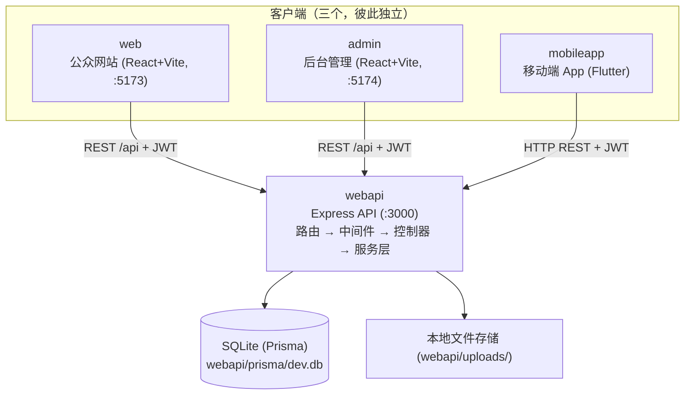
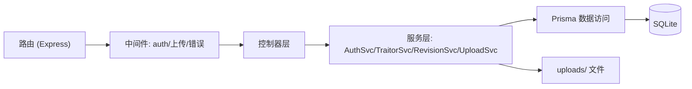
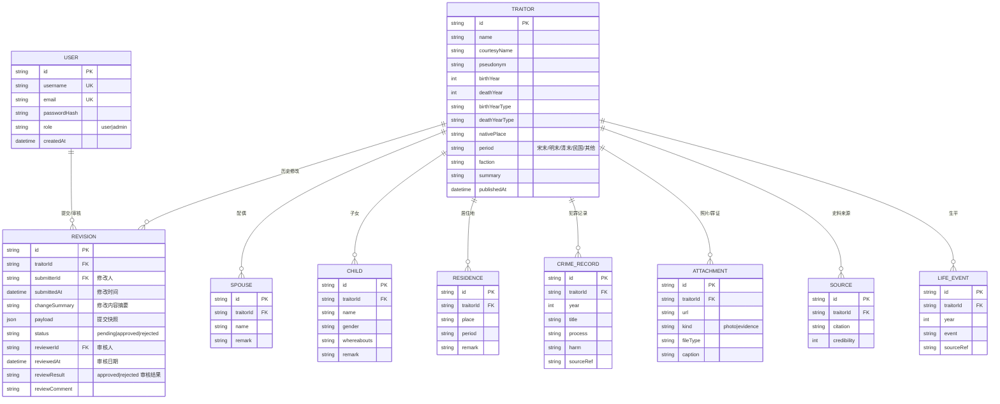

## 1. 架构设计



**架构说明（根目录仅含四个完全独立的子项目）**：
- **`web/`**：公众网站——首页/详情/关于/认证/提交/编辑/个人中心/修改历史；
- **`admin/`**：后台管理独立应用（与公众站物理隔离）——管理员登录/待审队列/审核详情；
- **`mobileapp/`**：Flutter 移动端 App——浏览/检索/档案详情/修改历史查看与登录，复用同一 Web API；
- **`webapi/`**：唯一后端，Express 分层为路由 → 中间件（鉴权/上传/错误捕获）→ 控制器 → 服务层（AuthSvc/TraitorSvc/RevisionSvc/UploadSvc）→ Prisma；Prisma schema/seed 位于 `webapi/prisma/`，上传文件存 `webapi/uploads/`；
- **无共享包**：各项目依赖、脚本、类型与校验各自维护，前后端以 REST DTO 约定对齐；
- **通信**：REST API + JWT 鉴权；web 与 admin 的 Vite dev server 代理 `/api` 与 `/uploads` → 3000；mobileapp 通过配置的 API 地址直连。

## 2. 技术说明
- **公众站 `web/`**：React@18 + tailwindcss@3 + vite + react-router-dom@6 + zustand + TypeScript
- **后台 `admin/`**：React@18 + tailwindcss@3 + vite + react-router-dom@6 + zustand + TypeScript（独立应用）
- **移动端 `mobileapp/`**：Flutter（Dart），通过 HTTP 访问 Web API，API 地址可配置
- **后端 `webapi/`**：Express@4 + TypeScript（ESM），通过 `dotenv` 加载 `webapi/.env`
- **数据库**：SQLite（经 Prisma ORM，文件 `webapi/prisma/dev.db`，schema 在 `webapi/prisma/schema.prisma`，无需外部服务）
- **鉴权**：jsonwebtoken（JWT）+ bcryptjs（密码哈希），角色 RBAC（visitor/user/admin）
- **文件上传**：multer（照片/罪证，存 `webapi/uploads/`，由 API 静态托管 `/uploads`）
- **校验**：zod（webapi 请求体校验）；各前端表单校验各自实现
- **类型约定**：无共享包，各客户端按 §4.5 DTO 定义自行维护类型

## 3. 路由定义（前端）

### 3.1 公众站 `web`（:5173）

| 路由 | 用途 | 鉴权 |
|------|------|------|
| `/` | 首页 | 公开 |
| `/traitor/:id` | 详情页 | 公开 |
| `/traitor/:id/history` | 修改历史 | 公开 |
| `/about` | 关于页 | 公开 |
| `/login` | 登录 | 公开 |
| `/register` | 注册 | 公开 |
| `/profile` | 个人中心（本人提交记录） | 登录 |
| `/submit` | 提交新档案 | 登录 |
| `/traitor/:id/edit` | 编辑已有档案 | 登录 |
| `*` | 404 | 公开 |

### 3.2 后台管理 `admin`（:5174，独立应用）

| 路由 | 用途 | 鉴权 |
|------|------|------|
| `/login` | 管理员登录 | 公开 |
| `/` | 管理首页（重定向到待审队列） | 管理员 |
| `/reviews` | 待审队列 | 管理员 |
| `/reviews/:rid` | 审核详情（新旧对比） | 管理员 |
| `*` | 404 | 公开 |

> 鉴权由各应用内 `ProtectedRoute` 守卫：未登录跳本应用 `/login`，非 admin 登录后跳回或提示无权限。

### 3.3 移动端 `mobileapp`（Flutter 页面清单）

| 页面 | 用途 | 鉴权 |
|------|------|------|
| 首页 | 统计看板/三维检索/人物卡片墙/事件时间线 | 公开 |
| 档案详情 | 人物信息/生平/犯罪记录/家族/照片罪证/史料/修改历史 | 公开 |
| 登录 / 注册 | 复用 Web API 认证 | 公开 |
| 个人中心 | 本人提交记录与审核状态 | 登录 |

## 4. API 定义

> 鉴权头：`Authorization: Bearer <jwt>`。角色标识写入 JWT payload。

### 4.1 认证
| 方法 | 路径 | 入参（body） | 出参 | 说明 |
|------|------|--------------|------|------|
| POST | `/api/auth/register` | `{ username, email, password }` | `{ token, user }` | 注册，默认 role=user |
| POST | `/api/auth/login` | `{ account, password }` | `{ token, user }` | account 可为邮箱或用户名 |
| GET | `/api/auth/me` | — | `{ user }` | 取当前用户（需登录） |

### 4.2 汉奸档案（公开读取）
| 方法 | 路径 | 说明 |
|------|------|------|
| GET | `/api/traitors` | 列表，支持 query：`name/yearFrom/yearTo/event/period` |
| GET | `/api/traitors/:id` | 详情（含配偶/子女/居住地/犯罪记录/照片/罪证/史料） |
| GET | `/api/traitors/:id/revisions` | 修改历史列表 |
| GET | `/api/traitors/stats` | 首页统计（总数/被判刑/子女信息数/后代现状数） |
| GET | `/api/traitors/timeline` | 重大事件时间线节点列表 |

### 4.3 提交与编辑（需登录）
| 方法 | 路径 | 说明 |
|------|------|------|
| POST | `/api/traitors` | 提交新档案（JSON，含 changeSummary + 全字段）→ 创建 Revision(traitorId=null, status=pending) |
| PUT | `/api/traitors/:id` | 编辑已有档案（JSON，含 changeSummary）→ 创建 Revision(traitorId=id, status=pending)，原发布版本保持可见 |
| GET | `/api/me/submissions` | 本人提交记录与状态 |
| POST | `/api/uploads` | 上传照片/罪证文件（multipart `file` + `kind=photo|evidence`）→ 返回 `{ id, url, kind, fileType }` |

### 4.4 后台审核（需管理员）
| 方法 | 路径 | 说明 |
|------|------|------|
| GET | `/api/admin/revisions` | 待审队列，query：`status` |
| GET | `/api/admin/revisions/:rid` | 审核详情（新旧对比快照） |
| POST | `/api/admin/revisions/:rid/review` | `{ result: 'approved'\|'rejected', comment }` |

### 4.5 类型定义（节选）
```typescript
interface TraitorDTO {
  id: string;
  name: string;
  courtesyName?: string;
  pseudonym?: string;
  birthYear: number | null;
  deathYear: number | null;
  birthYearType: YearType;
  deathYearType: YearType;
  nativePlace: string;
  aliases: string[];
  identityTags: string[];
  period: Period;
  faction: string;
  summary: string;
  spouses: Spouse[];
  children: Child[];
  residences: Residence[];
  crimeRecords: CrimeRecord[];
  attachments: Attachment[];      // 照片与罪证统一通过 kind 字段区分
  sources: Source[];
  relatedIds: string[];
}

interface Revision {
  id: string;
  traitorId: string | null;       // 新建时为 null
  submitterId: string;             // 修改人
  submittedAt: string;            // 修改时间
  changeSummary: string;           // 修改内容摘要
  payload: TraitorDTO;            // 提交内容快照
  status: 'pending' | 'approved' | 'rejected';
  reviewerId: string | null;      // 审核人
  reviewedAt: string | null;      // 审核日期
  reviewResult: 'approved' | 'rejected' | null; // 审核结果
  reviewComment: string | null;
}
```

## 5. 服务端架构图



分层（代码位于 `webapi/src/`）：路由 → 中间件（鉴权/上传/错误捕获）→ 控制器（HTTP 编解码）→ 服务（业务逻辑/审核流程）→ Prisma → SQLite。

## 6. 数据模型

### 6.1 数据模型定义



### 6.2 数据定义语言
采用 Prisma schema（`webapi/prisma/schema.prisma`），由 `prisma migrate dev` 或 `prisma db push` 生成 SQLite 表结构。关键模型节选：

```prisma
model User {
  id           String    @id @default(cuid())
  username     String    @unique
  email        String    @unique
  passwordHash String
  role         String    @default("user") // user | admin
  createdAt    DateTime  @default(now())
  revisions    Revision[] @relation("Submitter")
  reviewed     Revision[] @relation("Reviewer")
}

model Traitor {
  id          String   @id @default(cuid())
  name        String
  courtesyName String?
  pseudonym   String?
  birthYear   Int?
  deathYear   Int?
  birthYearType String
  deathYearType String
  nativePlace String
  period      String   // 宋末|明末|清末|民国|其他
  faction     String
  summary     String
  publishedAt DateTime @default(now())
  spouses     Spouse[]
  children    Child[]
  residences  Residence[]
  crimeRecords CrimeRecord[]
  // 照片与罪证统一通过 Attachment.kind 区分（photo | evidence）
  attachments Attachment[]
  sources     Source[]
  lifeEvents  LifeEvent[]
  relatedIds  String   // JSON array of ids
  revisions   Revision[]
}

model Revision {
  id            String   @id @default(cuid())
  traitorId     String?   // 新建时 null
  traitor       Traitor? @relation(fields: [traitorId], references: [id])
  submitterId   String
  submitter     User     @relation("Submitter", fields: [submitterId], references: [id])
  submittedAt   DateTime @default(now())
  changeSummary String
  payload       String   // JSON 快照
  status        String   @default("pending") // pending|approved|rejected
  reviewerId    String?
  reviewer      User?    @relation("Reviewer", fields: [reviewerId], references: [id])
  reviewedAt    DateTime?
  reviewResult  String?  // approved|rejected
  reviewComment String?
}

model Attachment {
  id         String   @id @default(cuid())
  traitorId  String
  traitor    Traitor  @relation(fields: [traitorId], references: [id])
  url        String
  kind       String   // photo | evidence
  fileType   String
  caption    String?
}
```

初始管理员账号：首次启动时由种子脚本（`webapi/prisma/seed.ts`）按环境变量创建一个 role=admin 用户，其余注册用户默认 role=user。

## 7. 命令清单与端口约定

### 7.1 端口

| 应用 | 端口 | 说明 |
|------|------|------|
| webapi | 3000 | REST + JWT + 静态托管 `/uploads` |
| web（公众站） | 5173 | Vite dev，代理 `/api`、`/uploads` → 3000 |
| admin（后台） | 5174 | Vite dev，代理 `/api`、`/uploads` → 3000 |
| mobileapp | — | 原生 App，API 地址可配置 |

### 7.2 命令清单（各项目内独立执行）

**webapi：**

| 命令 | 说明 |
|------|------|
| `npm run dev` | 启动 API（`tsx watch src/index.ts`），监听 3000 |
| `npm run start` | 生产模式启动 API |
| `npm run build` / `npm run check` | 构建 / TypeScript 类型检查 |
| `npm run db:generate` | 生成 Prisma client |
| `npm run db:push` | 同步 schema 到 SQLite（开发用，无迁移文件） |
| `npm run db:migrate` | 生成并应用迁移（正式版次） |
| `npm run db:seed` | 初始化 / 重置管理员（admin / admin123456） |
| `npm run db:studio` | Prisma Studio 可视化数据库 |

**web / admin：**

| 命令 | 说明 |
|------|------|
| `npm run dev` | Vite 开发服务器（web :5173 / admin :5174） |
| `npm run build` | 构建生产包（tsc + vite build） |
| `npm run check` | TypeScript 类型检查 |

**mobileapp：**

| 命令 | 说明 |
|------|------|
| `flutter run` | 运行到设备/模拟器 |
| `flutter build apk` / `flutter build ipa` | 打包 |
